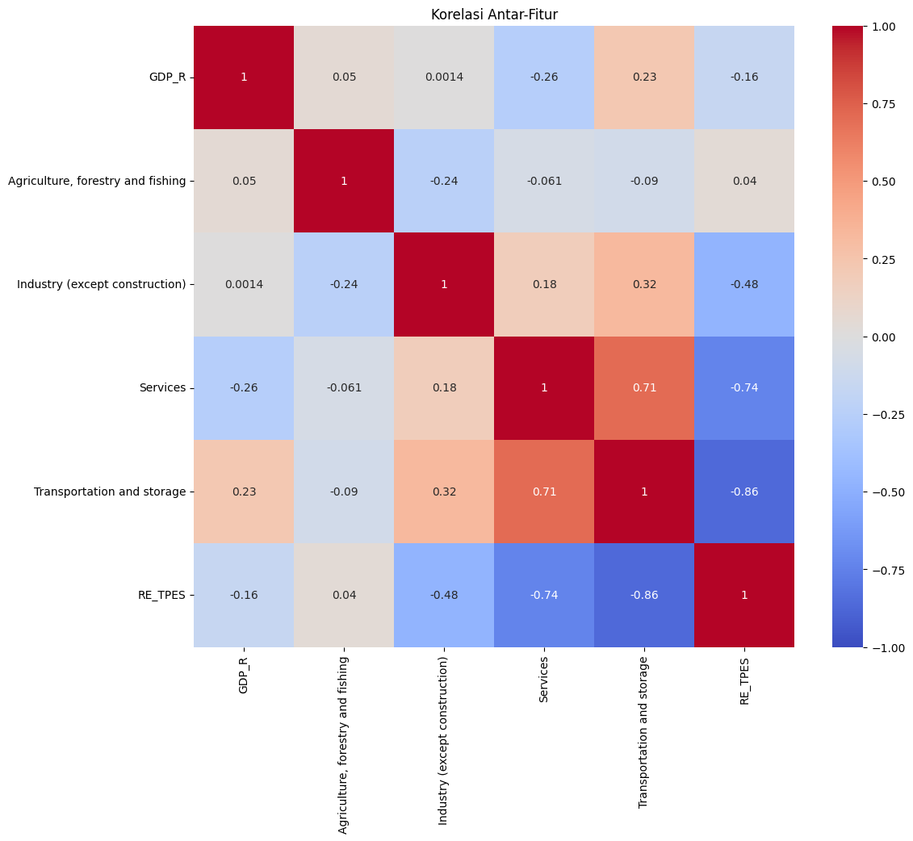
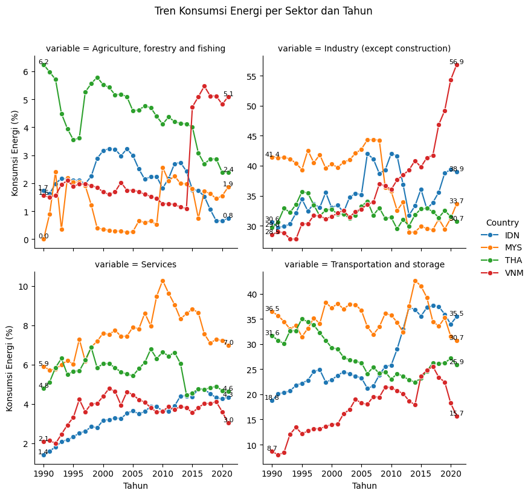
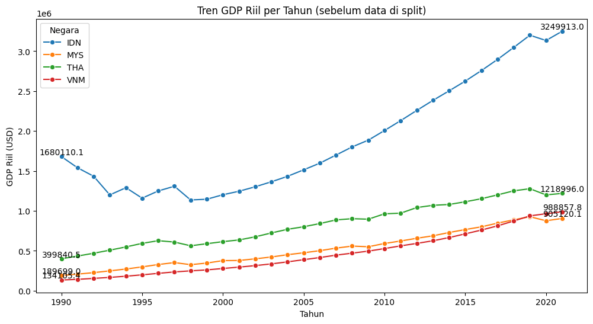
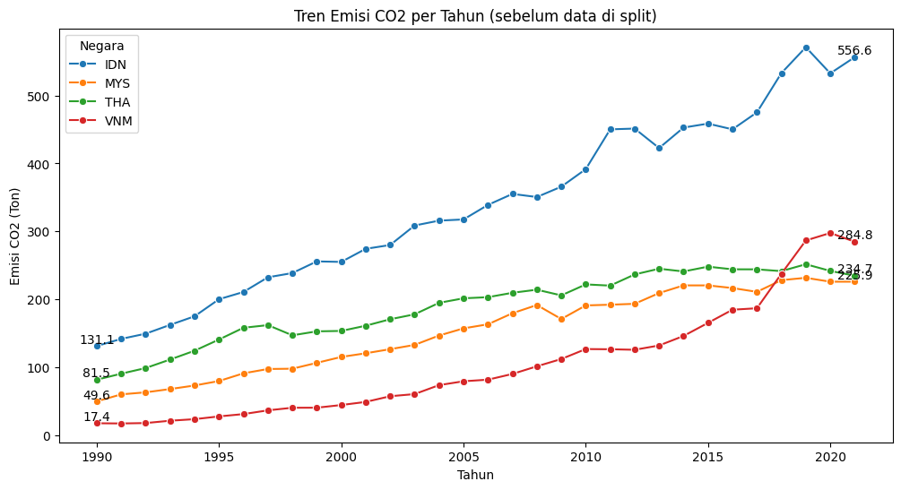
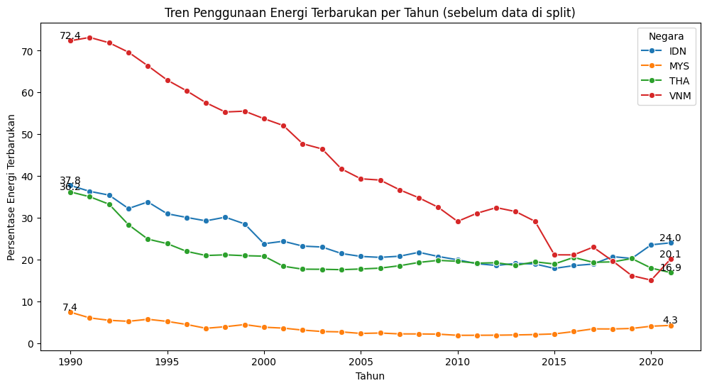

# CO2 Emision Prediction 🚕💨

Project ini dibuat untuk kebutuhan final Data Science Botcamp di Startup Campus.

**Judul** : “Efektivitas Penggunaan Energi Terbarukan dalam Penurunan Emisi CO₂ di Empat Negara ASEAN : Indonesia, Malaysia, Thailand, Vietnam"                                                                                                                                                                                                                                                                                                                                                                  
## Problem Statement

Selama periode 1990-2021, pertumbuhan ekonomi dikeempat negara ASEAN yang menjadi fokus penelitian kami (Indonesia, Malaysia, Thailand, dan Vietnam) sangat bergantung pada energi fosil untuk mendukung sektor-sektor penting, seperti industri dan transportasi. Hal ini menyebabkan emisi CO₂ yang tinggi dan menghambat upaya untuk mengurangi dampak perubahan iklim. Potensi besar dari energi terbarukan seperti tenaga surya, angin, dan biomassa belum sepenuhnya dimanfaatkan, meskipun teknologi dan kebijakan pendukung semakin berkembang. Oleh karena itu, penting untuk mengevaluasi dan mengidentifikasi solusi yang dapat mempercepat transisi ini, dengan memperhatikan kondisi ekonomi dan ketergantungan pada energi fosil yang ada

## Goals

Membuat model prediktif, mengetahui faktor yang paling mempengaruhi kenaikan emisi co2 dan Membuat visualisasi melalui dashboard interaktif untukpemantauan konsumsi energi, yang fokus pada penggunaan energi terbarukan

## Dataset

Dataset utama diambil dari real dataset yang bersumber pada https://data-explorer.oecd.org/. dengan cakupan waktu dari tahun 1990 - 2021 dengan referensi di Empat Negara ASEAN : Indonesia, Malaysia, Thailand, Vietnam”

## Dashboard Link
https://public.tableau.com/views/PrintilanFinpro/Dashboard2?:language=en-US&publish=yes&:sid=&:redirect=auth&:display_count=n&:origin=viz_share_link

## Data Dictionary

- **Real Gdp**: Total nilai barang dan jasa yang dihasilkan oleh suatu negara setelah disesuaikan dengan inflasi.
- **Co2 Pbem**:  Jumlah total emisi CO₂ yang dihasilkan dari aktivitas produksi suatu negara.
- **RE_TPES**: Proporsi energi terbarukan,
- **Agriculture, Forestry, and Fishing**: Konsumsi energi berdasarkan aktifitas ekonomi di sektor pertanian, kehutanan, dan perikanan
- **Industry (except construction)**: Konsumsi energi berdasarkan aktifitas ekonomi di sektor industri, kecuali sektor konstruksi
- **Services**: Konsumsi energi berdasarkan aktifitas ekonomi di sektor jasa (perdagangan, pendidikan, layanan kesehatan)
- **Transportation and Storage**: Konsumsi energi berdasarkan aktifitas ekonomi di sektor transportasi (pengangkutan barang/orang) dan penyimpanan logistik

## Target

-  **Co2 Pbem** : Jumlah total emisi CO₂ yang dihasilkan dari aktivitas produksi suatu negara.

## Data Pre-Processing

Pada tahap ini kami melalukan beberapa tahapan: 
-	Pada tahap pertama kami mengecek missing value dan duplikasi data dan didapatkan tidak ada mising value dan duplikasi pada data. 
-	Pada tahap kedua kami membagi data pelatihan dan uji diawal untuk mencegah kebocoran data yaitu dengan rasio 80 : 20. 
-	Pada tahap ketiga kami mengecek outlier pada data dan ditemukan beberapa variabel terdapat outlier yang kemudian kami handling menggunakan metode IQR. 
-	Kemudian pada tahap keempat kami melakukan drop beberapa variabel yang kami tidak gunakan yaitu negara dan tahun dan kemudian kami lakukan scaling pada data,  dengan menggunakan minmax scaler.

## Explanatory Data Analysis (EDA)

### Heatmap [melihat hubungan antar variabel]

**Insight** : energi terbarukan memiliki korelasi negatif dengan sektor jasa dan transportasi,, menunjukkan bahwa peningkatan energi terbarukan dapat menekan emisi CO2 tanpa menghambat ekonomi. Namun perlu di barengin dengan kebijakan trasnportasi dan jasa yang menggunakan energi ramah lingkungan seperti listrik

### Tren Sektor Konsumsi Energi [melihat tren konsumsi energi]

**Insight** : menunjukkan sektor industri dan transportasi sebagai konsumen energi utama dengan pola berbeda di tiap negara, sementara sektor pertanian menurun akibat modernisasi. Lalu untuk sektor jasa hanya signifikan di negara Thailand, yang mencerminkan ketergantungan pada layanan dan pariwisata

### Hubungan antara Real Gdp dengan Emisi Co2 [melihat hubungan antara 2 variabel]

**Insight** :  peningkatan riil GDP di empat negara diikuti oleh kenaikan emisi CO2, yang mengindikasikan ketergantungan pada energi fosil. Untuk mengurangi emisi CO2 tanpa menghambat ekonomi, penting untuk beralih ke energi terbarukan

### Hubungan energi terbarukan dengan Emisi Co2 [melihat hubungan antara 2 variabel]

**Insight** :   penurunan penggunaan energi terbarukan berbanding lurus dengan peningkatan emisi CO2 di empat negara ASEAN, terutama Vietnam, yang mengalami penurunan drastis setelah tahun 2016. Hal ini dipicu oleh pertumbuhan ekonomi pesat, peningkatan kebutuhan listrik, serta kebijakan Rencana Induk Ketenagalistrikan Nasional yang lebih mengandalkan pembangkit berbasis batu bara. Selain itu, kendala investasi di EBT dan kebijakan tarif energi yang lebih mendukung energi fosil turut memperburuk situasi ini

## Inferensial Statistic
- metode OLS, pertumbuhan ekonomi, energi terbarukan, dan sektor industri berkontribusi pada kenaikan emisi CO2, sedangkan sektor jasa, transportasi, serta pertanian berkontribusi pada pengurangan emisi CO2
- uji serempak, bahwa PDB riil, konsumsi energi, dan energi terbarukan bersama-sama memengaruhi total emisi CO₂ di empat negara.
- uji parsial, menghasilkan seluruh variabel penelitian mempengaruhi emisi CO2 di keempat negara tersebut
- analisis varians (anova), Menunjukkan adanya perbedaan signifikan antara konsumsi energi antar sektor-sektor yang diuji, yang berarti bahwa setiap sektor memiliki karakteristik konsumsi yang berbeda-beda satu sama lain.

## Model Selection and Analysis
**a.	Dasar Teori & Justifikasi Pemilihan Model** : 
-	Gradient Boosting Regression: Teknik ensemble yang menggabungkan beberapa model lemah untuk meningkatkan akurasi prediksi. Model ini bekerja dengan mengoptimalkan kesalahan residual secara bertahap untuk mendapatkan prediksi yang lebih baik. Gradient Boosting sangat cocok untuk menangani data dengan fitur penting yang saling berinteraksi
-	K-Nearest Neighbors Regression (KNN): Menggunakan jarak antar data untuk membuat prediksi. Pendekatan ini efektif untuk data kecil dengan pola lokal yang signifik
-	Linear Regression: Metode dasar untuk menemukan hubungan linier antara variabel independen dan dependen. Sederhana namun penting sebagai baseline untuk mengevaluasi model lain
-	Random Forest Regression: Metode ensemble yang menggunakan banyak pohon keputusan untuk menangkap pola non-linear. Random Forest mengurangi risiko overfitting melalui agregasi hasil prediksi dari beberapa pohon
-	Decision Tree Regression: Membangun pohon berdasarkan pembagian variabel yang mengurangi impuritas. Mudah diinterpretasikan tetapi rentan terhadap overfitting pada data kecil
  
**b.	Modifikasi Model**
Setelah memilih model, kami melakukan tuning parameter untuk meningkatkan performa:
-	Gradient Boosting: Parameter subsample ditambahkan untuk meningkatkan generalisasi, bersama dengan tuning learning_rate dan n_estimators menggunakan Grid Search.
-	KNN: Eksperimen dilakukan pada berbagai nilai k untuk menemukan jumlah tetangga terbaik, serta normalisasi data untuk memperbaiki perhitungan jarak.
-	Linear Regression: Tidak dilakukan modifikasi karena metode ini digunakan sebagai baseline model.
-	Random Forest: Penyesuaian parameter seperti n_estimators, max_depth, dan max_features untuk menyeimbangkan bias-varians).
-	Decision Tree: Penyesuaian kriteria pemisahan (criterion) seperti mse atau mae untuk meningkatkan performa.
  
**c.	Proses Training & Evaluasi Model**

Model dilatih menggunakan dataset yang telah melalui preprocessing, seperti penghapusan nilai kosong, normalisasi, dan encoding fitur kategori. Setelah data siap, setiap model dilatih menggunakan teknik cross-validation. Pendekatan ini memastikan hasil yang andal dengan mengurangi bias dari pembagian data.

**d.	Evaluasi model**

Model dievaluasi berdasarkan metrik R² , MAPE da, RMSLE pada data uji. Setelah mempertimbangkan metrix evaluasi kami memutus kan bahwa model Gradient Bosting
baseline model merupakan model terbaik yaitu dengan R² sebesar 0.985, kemudian MAPE sebesar 0.058 dan RMSLE sebesar 0.073, mencerminkan kemampuan mereka menangkap
pola kompleks dalam data. Alasan kami tidak menggunakan model setalah parameter tunning karena terjadi penurunan performa pada model.

## Fitur Importance

## Partial Dependen

## Recomendation
1.	Meningkatkan Energi Terbarukan
    - Pemanfaatan tenaga surya, angin, dan biomassa dapat membantu mencapai target net-zero emission.
    - Implementasi teknologi ramah lingkungan dapat mengurangi emisi hingga 20%-30%.
2.	Transformasi Sektor Transportasi yaitu dengan beralih ke kendaraan listrik dan transportasi publik berbasis energi bersih akan mengurangi ketergantungan kendaraan berbahan bakar fosil.
3.	Edukasi & Kampanye pentingnya pengurangan emisi CO₂ untuk mengubah pola konsumsi dan perilaku masyarakat.
 

## Thank You 👍
